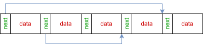

# Hashmap

Hashmap is a fixed-size, array-backed hash map for C with caller-defined element types and optional thread safety.

Collisions are represented as index-linked chains inside the same backing array rather than with separately allocated linked-list nodes. The map stores its own internal `int32_t next` metadata next to each user element, while caller-defined hash and comparison callbacks operate only on the user data.

The design targets predictable allocation and fast access in programs where the maximum table size can be chosen in advance. A thread-safe build is available for code that needs concurrent access.



## Описание

Hashmap - хеш-таблица фиксированного размера для C с хранением элементов в массиве, пользовательским типом элемента и необязательной потокобезопасностью.

Коллизии представлены цепочками индексов внутри того же массива, а не отдельно выделяемыми узлами связного списка. Таблица сама хранит служебное поле `int32_t next` рядом с каждым пользовательским элементом, поэтому изменять тип данных пользователя не требуется. Функции хеширования и сравнения работают только с пользовательскими данными.

Такая схема рассчитана на предсказуемое выделение памяти и быстрый доступ в программах, где максимальный размер таблицы можно выбрать заранее. Для кода с параллельным доступом доступна потокобезопасная сборка.

## Сборка

Обычная статическая библиотека:

```sh
cmake --preset release
cmake --build --preset release
```

Результат:

```text
build/release/libhashmap.a
```

Thread-safe target:

```sh
cmake --preset release
cmake --build build/release --target hashmap_threadsafe
```

Он компилируется с `THREAD_SAFETY`.

## Подключение

Репозиторий можно подключить через `add_subdirectory()` или собрать библиотеку отдельно и линковать ее вручную.

Публичный API находится в:

```text
include/array_hashmap.h
```

Примеры использования и benchmark/test code находятся в [`test/test.c`](test/test.c).

Собрать тестовый target:

```sh
cmake --build build/release --target hashmap_test
```

## Устройство

Таблица выделяется единым массивом фиксированного размера. При коллизии элементы связываются индексами внутри этого же массива, поэтому дополнительные heap allocations на каждый collision node не требуются.

Hash/comparison callbacks для add/find/delete можно задавать отдельно, что позволяет использовать одну структуру с разными способами поиска по данным.

## Статья

Подробное описание идеи: [статья на Habr](https://habr.com/ru/articles/878850/).
